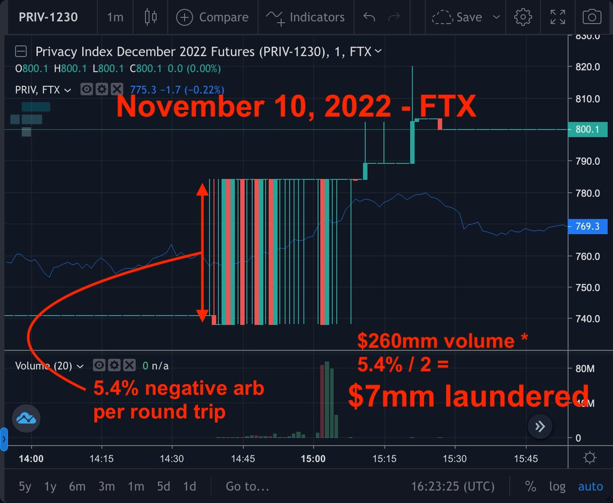
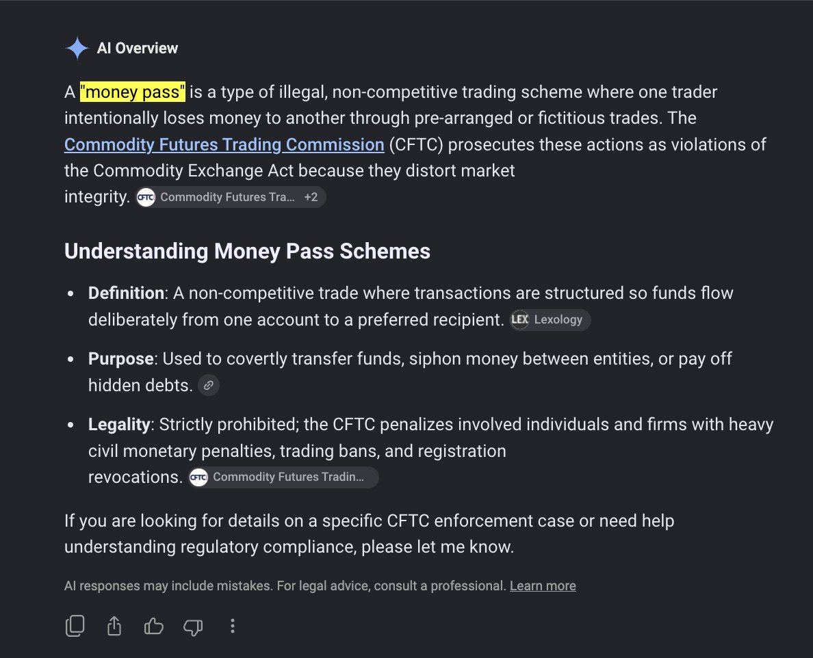
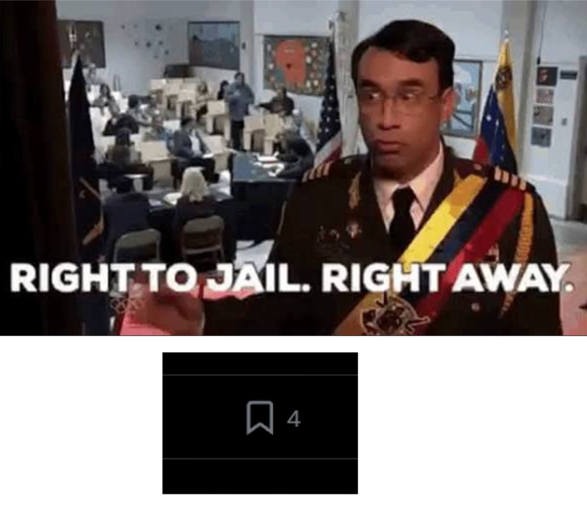
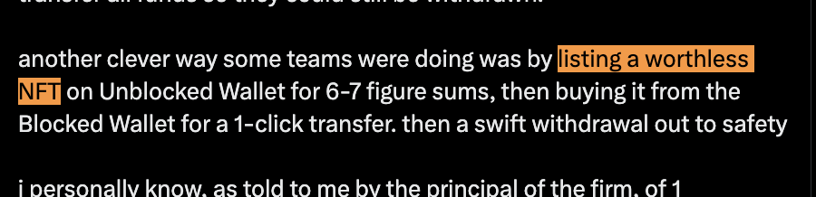

# Money Pass / Wash Trading 异常交易线索归档

- Author: @0xLoris (Loris)
- Published: 2026-08-14 23:12
- Status URL: https://x.com/0xloris/status/2088282621453439010?s=52
- Source Type: X long post with quoted tweet and media
- Capture Tool: twitter-cli
- Capture Note: 原帖为英文长推文，包含 1 张主图；作者后续补充 2 张图片，另有一张回复截图。因内容涉及洗钱 / money pass / wash trading，本归档只保留非操作性摘要、上下文、媒体和检测线索，不复写可直接照做的具体步骤。

## 合规处理说明

原帖讨论的是通过非竞争性或非经济性交易在账户之间转移价值的行为。该类行为在监管语境中可能涉及 `money pass`、`wash trading`、`fictitious sales`、市场操纵、虚假交易量和 AML 风险。

为避免把材料整理成非法资金转移教程，下方不复写原帖里的逐步操作描述，只保存：

- 原帖主题；
- 相关图像；
- 引用推文语境；
- 作者后续补充；
- 评论区对监管 precedent 和归因难点的补充；
- 官方可核验参考资料。

## 主帖非操作性摘要

作者提出一个观察问题：这类通过亏损性、非经济性交易把价值从一个账户转移到另一个账户的现象，在中心化交易所上很难外部分析，但在 `Hyperliquid / HL` 这类更透明的链上或准链上订单簿环境中更容易观察。

主帖用一个薄流动性市场的异常成交作为例子，说明某些账户可能通过有意承受负收益的来回成交，把资金价值转移给另一侧账户。作者特别声明该内容仅供信息分析，不是洗钱建议。

之后作者回顾了 FTX 崩盘期间的一段传闻：当时部分提款通道受限，拥有特定可提款条件的账户可能成为资金逃离路径；一些陷入困境的机构据称通过可信对手方、异常非经济性交易或高价 NFT 交易，把被限制账户中的价值转到可提款账户。该部分为作者个人听闻，未在本归档中独立核验。

## 引用推文

- Author: @Versace_Trader (Adverse Selectee)
- Tweet ID: 2088247646997839888

引用推文称 `AVGO/USDC` spot Broadcom 市场出现疑似洗钱 / 异常资金转移现象，并以“500 -> 119k”的金额变化作为观察线索。

## 作者后续补充

### 1. CFTC 术语：money pass

作者补充称，CFTC 执法术语中这类行为 apparently 被称为 `money pass`，并附图说明该术语通常指通过预先安排或虚构交易，让一方有意亏损、另一方获得资金的非法非竞争性交易安排。

### 2. CEX 难点在归因，不在执行

有读者说这在 CEX 上也可以发生。作者回应：

> the analysis / wallet attribution is difficult, not the execution of course

也就是说，中心化交易所内部当然可能发生类似非经济性成交，但外部观察者很难获得账户归因、订单归属和内部 KYC 关系。

### 3. NFT 路径已在原帖中提到

有读者问是否可以通过“稀有 NFT”在两个账户间转移价值。作者回复说这个点已经在主帖中，并附一张原帖截图。这里同样只作为异常价值转移路径的风险提示，不展开操作。

## 图片归档

### 图 1：FTX 期间异常成交示意

图中是 `Privacy Index December 2022 Futures (PRIV-1230)` 在 FTX 上的 1 分钟图，标注了 2022-11-10 的异常成交、估算成交量、负套利比例和可能转移资金规模。它的作用是说明：如果一个薄流动性合约突然出现大量明显非经济性成交，可能需要从 market surveillance 角度检查是否存在资金转移、wash trading 或账户协同行为。

### 图 2：money pass 定义截图

截图把 `money pass` 定义为非法、非竞争性交易安排：一方通过预先安排或虚构交易有意亏给另一方。图中还提到 CFTC 会把这类行为视为破坏市场完整性的行为。

### 图 3：合规风险梗图

这张图没有额外数据，只表达作者对该行为法律风险的态度。

### 图 4：NFT 片段截图

截图截取了主帖中关于 NFT 方式的片段。这里仅作为原帖上下文归档，不展开操作路径。

## 评论区关键补充

### 1. 执法 precedent

`@0xkuncoro` 评论指出，CFTC 对类似模式已有执法 precedent，包括 `TeraExchange` 的比特币 swap wash trade，以及 `Coinbase` 在 2021 年与 CFTC 达成的 650 万美元和解。

本归档额外核验到：

- CFTC 2016 年发布过 `money pass` 相关执法新闻，涉及 1,248 笔预先安排、非竞争性单一股票期货交易。
- CFTC 2023 年演讲中回顾了 `TeraExchange` 案，称其比特币 swap 的 round-trip 交易被视为 wash trade。
- CFTC 2021 年 Coinbase 和解公告提到 false reporting 和 wash trading。

### 2. 归因不能过度确定

`@HungHideki` 评论提醒，有些类似异常也可能是 API key 被盗后账户被抽走资金。这个补充很重要：链上或订单簿上看到“非经济性亏损成交”，不等于可以立刻证明是账户主动洗钱。

### 3. Meme 生态也可能常见

有评论称类似现象在 memecoin 生态里也不少见。这类说法没有提供可核验证据，但提示了一个方向：长尾、低流动性、弱监管和低透明发行市场，更容易出现异常自成交、对敲和价值转移。

## 外部参考

- CFTC Release 7403-16: https://www.cftc.gov/PressRoom/PressReleases/7403-16
- CFTC speech on digital asset derivatives enforcement: https://www.cftc.gov/PressRoom/SpeechesTestimony/opamcginley1
- CFTC Release 8369-21 on Coinbase: https://www.cftc.gov/PressRoom/PressReleases/8369-21
